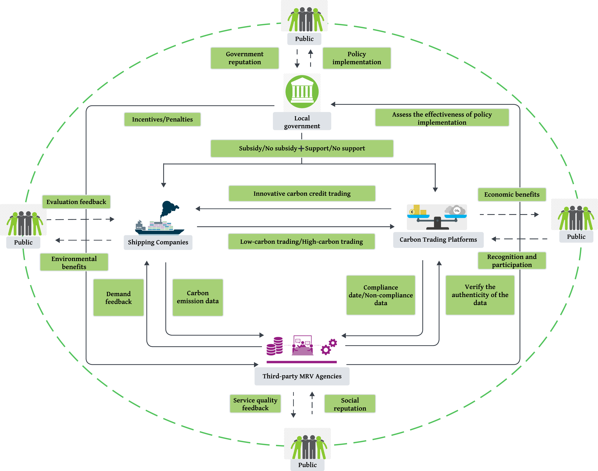

# Maritime ETS–MRV evolutionary game

MATLAB code and manuscript figures for **Emissions Trading and MRV Mechanism for Maritime Decarbonization: A Four-Party Evolutionary Analysis**.

The model examines government promotion, shipping-company participation, platform innovation and MRV verification. Parameters represent illustrative scenarios rather than empirically calibrated estimates.

## Model framework



[View the literature overview](figures/Fig_literature.png).

## Run the numerical experiments

Use MATLAB R2022a with base MATLAB. Set the repository root as the current folder and run:

```matlab
outputDir = run_all;
```

The code writes PDF/PNG figures, CSV/MAT simulation data, scenario parameters and run settings to a timestamped `results/` folder. The 100-by-100 joint scan involves 10,000 ODE integrations. The uploaded manuscript figures in `figures/` are separate from newly generated results.

| Location | Contents |
|---|---|
| `run_all.m` | Main execution entry |
| `config/` | Scenario parameters and numerical settings |
| `src/` | Replicator equations, Jacobian, integration and export functions |
| `experiments/` | Pure-scenario, sensitivity, joint-grid and mixed-population experiments |
| `figures/` | Uploaded manuscript figures linked below |

## Manuscript figures

PDF panels are linked for viewing or downloading; the PNG framework diagram is displayed above. Labels are used instead of figure numbers to accommodate manuscript revisions.

### Pure-strategy scenarios

| Scenario | 3D projection | Time evolution |
|---|---|---|
| E1 (1,1,1,1) | [PDF](figures/Fig_E1a.pdf) | [PDF](figures/Fig_E1b.pdf) |
| E2 (1,1,1,0) | [PDF](figures/Fig_E2a.pdf) | [PDF](figures/Fig_E2b.pdf) |
| E3 (1,1,0,1) | [PDF](figures/Fig_E3a.pdf) | [PDF](figures/Fig_E3b.pdf) |
| E8 (1,0,0,0), setting 1 | — | [PDF](figures/Fig_E8_Scenario4.pdf) |
| E8 (1,0,0,0), setting 2 | — | [PDF](figures/Fig_E8_Scenario8.pdf) |
| E9 (0,1,1,1) | [PDF](figures/Fig_E9a.pdf) | [PDF](figures/Fig_E9b.pdf) |
| E16 (0,0,0,0) | [PDF](figures/Fig_E16a.pdf) | [PDF](figures/Fig_E16b.pdf) |

The two E8 settings correspond to `E8_case1` and `E8_case2` in the code; their uploaded filenames retain the original Scenario4 and Scenario8 labels.

### Sensitivity and joint-parameter experiments

| Experiment | Figure |
|---|---|
| Initial government share | [PDF](figures/Fig_InitialWillingness.pdf) |
| Government incremental cost, DeltaC1 | [PDF](figures/Fig_DeltaC1.pdf) |
| Company incremental cost, DeltaC2 | [PDF](figures/Fig_DeltaC2.pdf) |
| Platform innovation cost, DeltaC3 | [PDF](figures/Fig_DeltaC3.pdf) |
| Strict-verification incremental cost, DeltaC4 | [PDF](figures/Fig_DeltaC4.pdf) |
| Company incentive, P1 | [PDF](figures/Fig_P1.pdf) |
| Company penalty, F1 | [PDF](figures/Fig_F1.pdf) |
| Government benefit, S | [PDF](figures/Fig_S.pdf) |
| MRV reputational benefit, V | [PDF](figures/Fig_V.pdf) |
| Initial government share versus P1 | [PDF](figures/Fig_Heatmap_x0_P1_FourActors.pdf) |

### Mixed-population examples

| Example | Figure |
|---|---|
| Trajectories on the boundary z = r = 0 | [PDF](figures/Fig_MixedStrategy_Trajectories.pdf) |
| Boundary mixed equilibrium: phase diagram | [PDF](figures/Fig_MixedStrategy_PhaseDiagram.pdf) |
| Boundary mixed equilibrium: time evolution | [PDF](figures/Fig_MixedStrategy_TimeTrajectories.pdf) |
| Equilibrium-line point: phase diagram | [PDF](figures/Fig_MixedStrategy_PhaseDiagram-stable.pdf) |
| Equilibrium-line point: time evolution | [PDF](figures/Fig_MixedStrategy_TimeTrajectories-stable.pdf) |

The uploaded filenames retain the original `-stable` suffix. The corresponding point (1,0.4213,0,0) lies on an equilibrium line; it is not an isolated asymptotically stable attractor. The code names these outputs `EquilibriumLine_*`. The boundary point (1/3,2/3,0,0) is unstable in the full four-dimensional system. Exact-equilibrium time-series plots alone do not establish attraction.

## Reproduction settings

State order is `[x,y,z,r]`: government, shipping companies, platforms and MRV agencies. Each entry denotes an active-strategy population share. The solver is `ode45`, with `RelTol=1e-8`, `AbsTol=1e-10` and `MaxStep=0.25`; standard trajectories use 501 output times. Model time is not calendar time.

- **Pure scenarios:** 3D panels use 125 initial conditions, with five values each for x,y in [0.01,0.99] and z in [0.1,0.99], and r=0.5, over [0,50]. Time-series panels start at [0.01,0.99,0.99,0.99], over [0,20].
- **Sensitivity:** baseline `E8_case1`, initial shares 0.5 and horizon [0,10], varying only the indicated parameter or initial government share.
- **Joint grid:** the same baseline, 100 values each for x(0) in [0,1] and P1 in [0,10]. Outputs are shares at time 10, not equilibrium classifications.
- **Mixed-boundary trajectories:** ten initial points on z=r=0, random seed 252, and horizon [0,50].

The common pure-panel initial conditions and random seed are documented reconstruction choices: the original scripts did not preserve every panel's initial conditions or the original random seed. Accordingly, exact recovery of every uploaded curve is not claimed. Compare generated results with the final manuscript using the stated settings.

The minimal code package passed static MATLAB R2022a syntax checks. Native MATLAB execution was not performed in the packaging environment.
